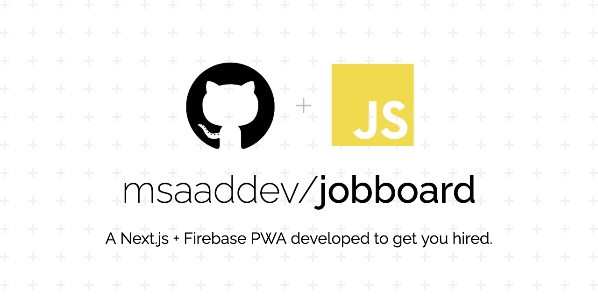
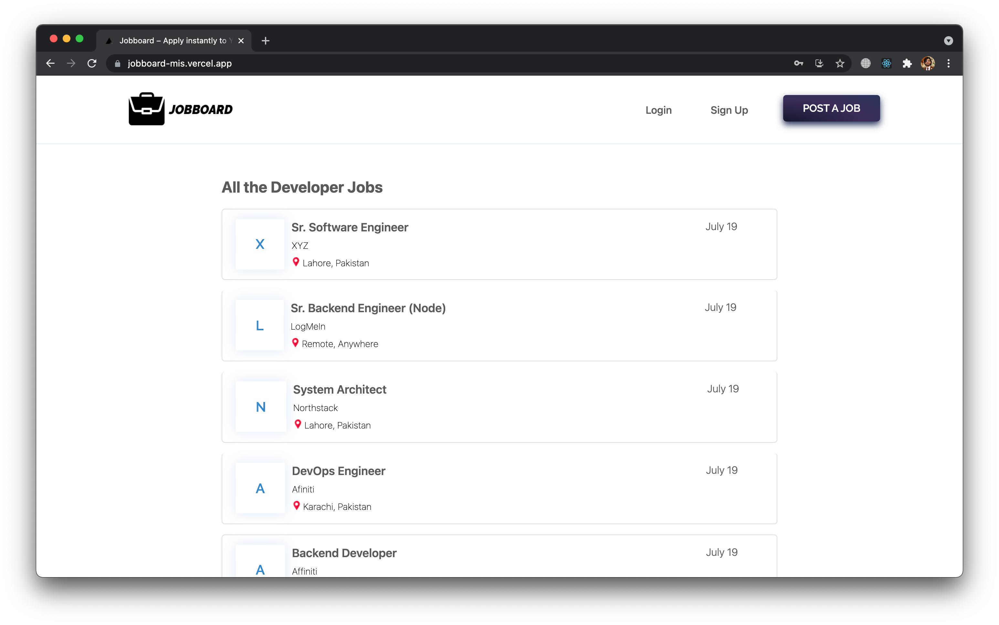
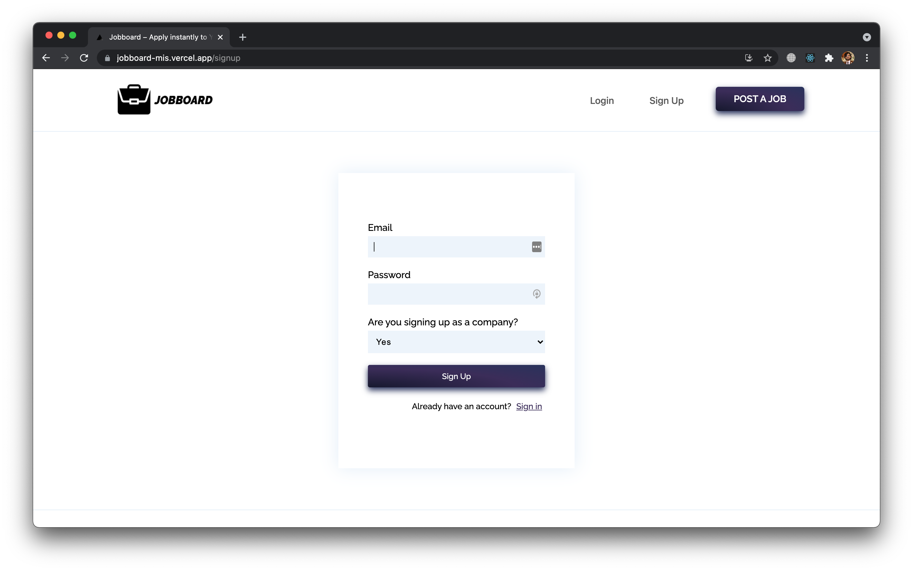
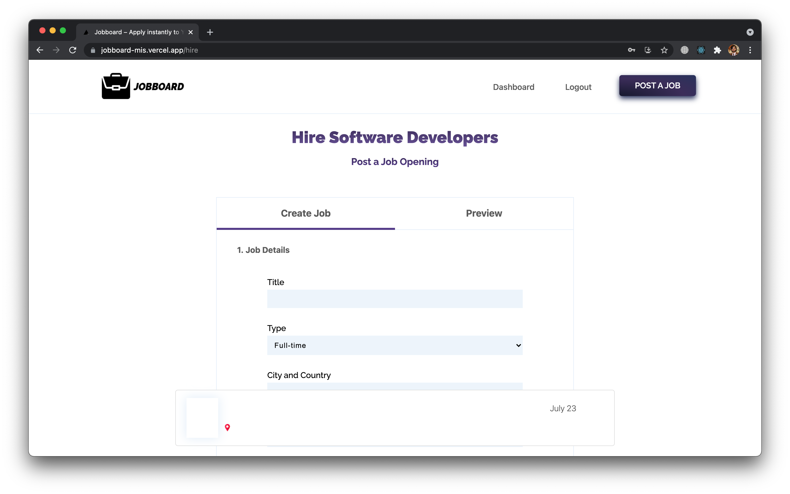
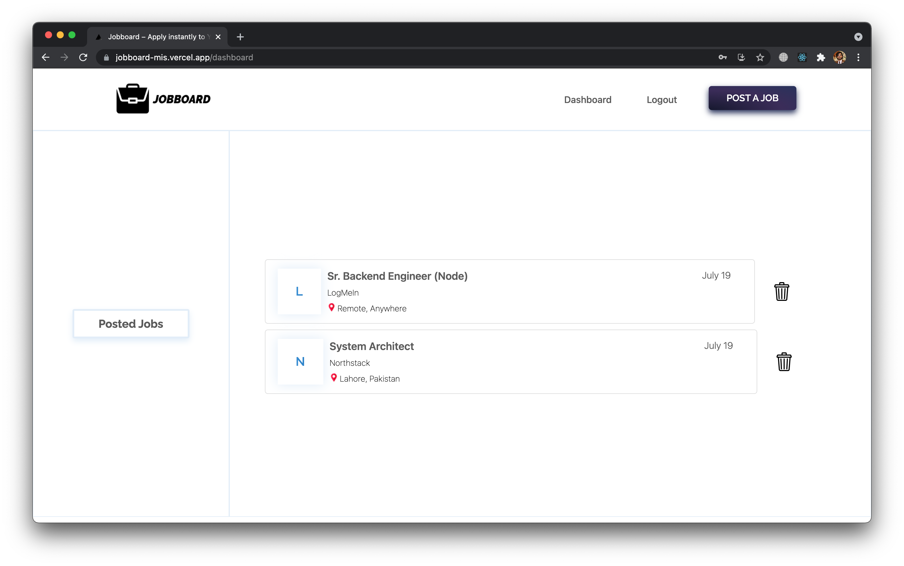

	<strong>A progressive web app built using Next.js and Firebase where companies can put on a job ad and potential candidates can reach out to them.</strong>

- **PWA**: A progressive web app so you can also install and use it as a desktop app.
- **Company**: Sign up as a company to post jobs on the web app (uses Firebase Authentication).
- **User**: Sign up as a user to apply to any jobs.
- **Job Post**: Post jobs instantly to the app after you have logged in.
- **Apply**: Quick and easy way to apply to any job listed on the website.
- **Dashboard**: Separate dashboards for both the users and the companies so they can keep track of their job application and listing respectively.
- **Delete Job**: Companies can also delete their posted jobs from their dashboard
- **Firestore**: Uses firestore for the database to store all the user data.
- **Deployed**: Hosted on Vercel and is fully functional.
- **MIT Licensed**: Completely open-source. Feel free to contribute.

>The design is a replica of jsjobbs.com with additional features implemented like sign up, login, dashboard.

## 💻 Images

### Homepage

### Sign up

### Job Post

### Dashboard

## 👨🏻‍💻 Contributing

Make sure you read the [contributing guidelines](https://github.com/msaaddev/jobboard/blob/master/contributing.md) before opening a PR. If you want something else to **integrate** with the CLI, open an issue in the repository and I will get back to it.

## ⚡️ Other Projects

I have curated a [detailed list](https://github.com/msaaddev/open-source) of all the open-source projects I have authored. Do take out a moment and take a look.

## 🔑 License & Conduct

- MIT © [Saad Irfan](https://github.com/msaaddev)
- [Code of Conduct](https://github.com/msaaddev/jobboard/blob/master/code_of_conduct.md)
